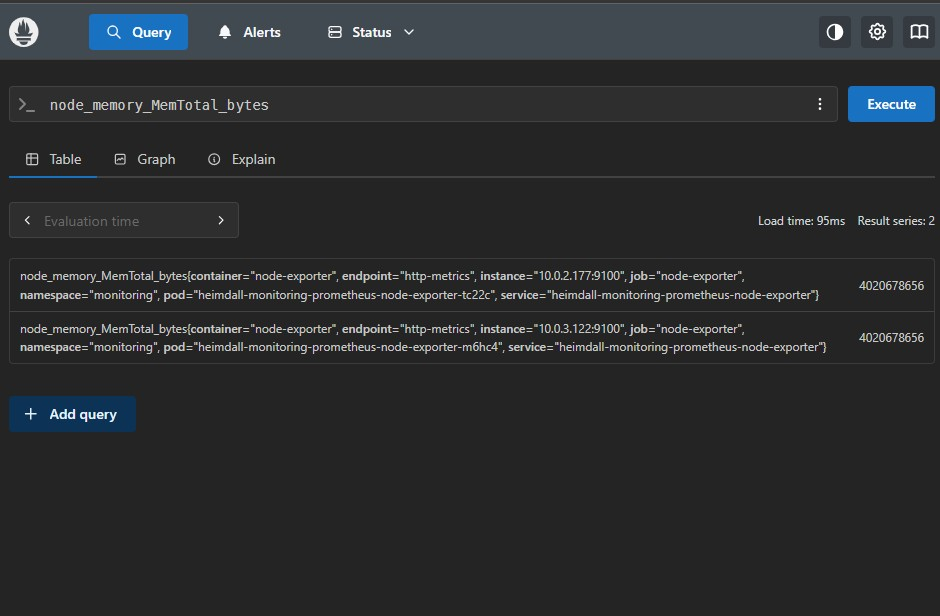
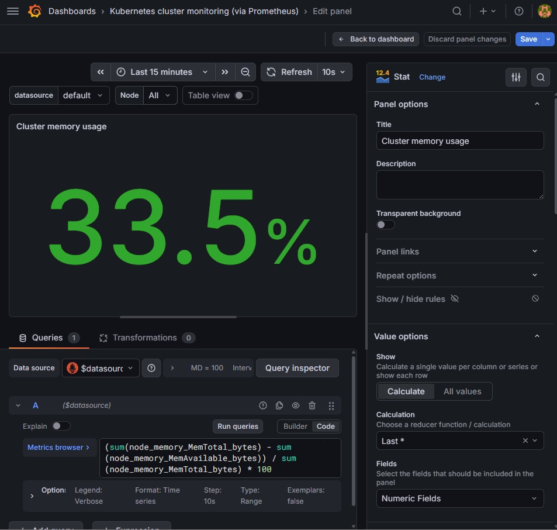
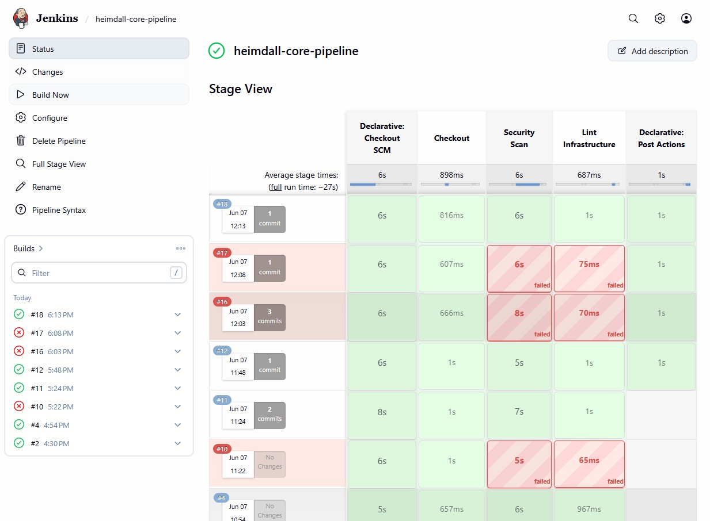
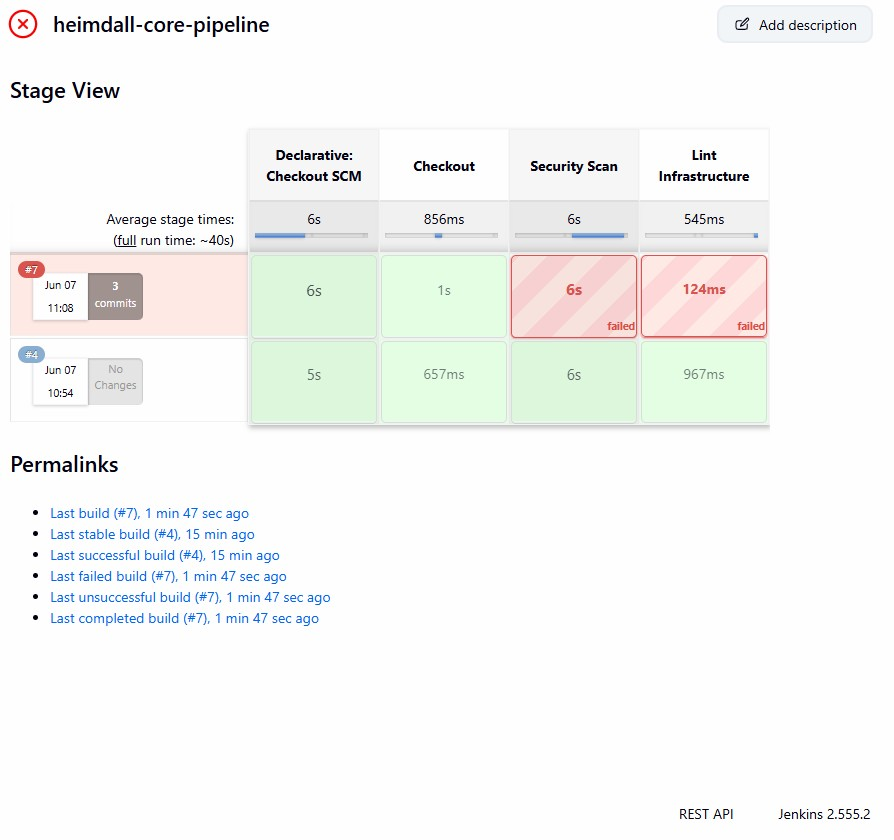

# Heimdall Platform: Secure & Observability-Ready EKS Architecture

**Heimdall** is a production-grade Infrastructure as Code (IaC) platform designed for **Amazon EKS**, integrating enterprise-level security, deep observability, and automated CI/CD workflows.

## 🏗️ System Architecture
Heimdall prioritizes security and visibility from the ground up:
* **Orchestration:** EKS Cluster (v1.35) deployed within a private VPC.
* **Security:** Implements **IRSA (IAM Roles for Service Accounts)** to follow the principle of least privilege, eliminating the need for static credentials in pods.
* **Compliance:** Hardened S3 buckets featuring KMS encryption, versioning, public access blocks, and automated lifecycle policies.
* **CI/CD:** Robust Jenkins pipelines with automated **Security Gates (Checkov)**, ensuring infrastructure compliance before deployment.

---

## 🛠️ Key Components

### 1. Automation & CI/CD
The lifecycle is managed through declarative Jenkins pipelines ensuring quality and security:
* **Stages:** Checkout SCM → Security Scan → Lint → Terraform Plan → Post Actions.
* **Quality:** Automated Security Gates fail the build if infrastructure violates predefined security policies.

### 2. Enterprise-Grade Observability
Full integration with the **Prometheus + Grafana** stack to provide deep insights into cluster metrics.
* **Validation:** Real-time metric verification (e.g., node memory usage).
* **Visualization:** Custom Grafana dashboards for cluster performance monitoring.

### 3. Proactive Security (DevSecOps)
The platform implements strict controls to meet security standards:
* **Encryption:** AES256/KMS by default.
* **Access:** Dedicated Service Accounts per microservice.
* **Auditability:** Control Plane logging enabled for `kube-apiserver` and `authenticator`.

---

## 📸 Verification Gallery

### Monitoring
| Prometheus Metrics | Grafana Dashboard |
| :--- | :--- |
|  |  |

### CI/CD & Security
| Pipeline Status | Compliance Check |
| :--- | :--- |
|  |  |

---

## 🚀 Deployment
To deploy the infrastructure:
1. Ensure AWS credentials are configured.
2. Initialize and deploy: `terraform init && terraform apply`.
3. Synchronize manifests via GitOps (ArgoCD integrated).

---
*Built with passion for DevOps excellence.*
